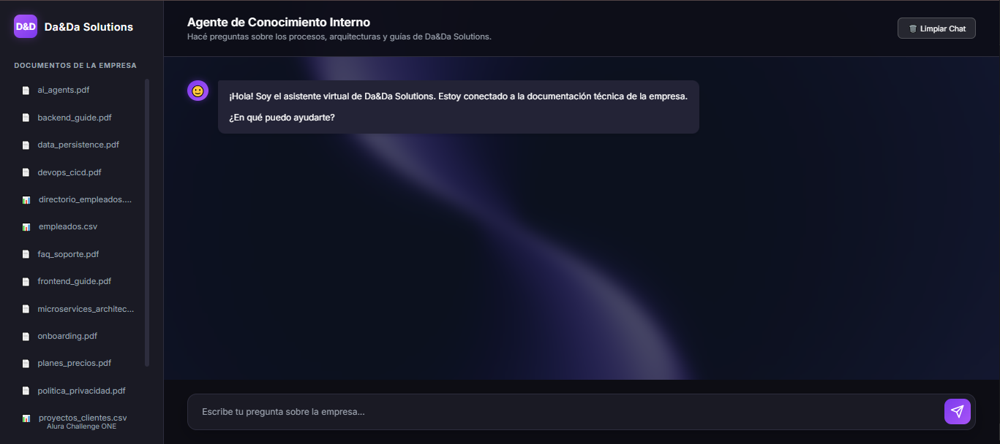
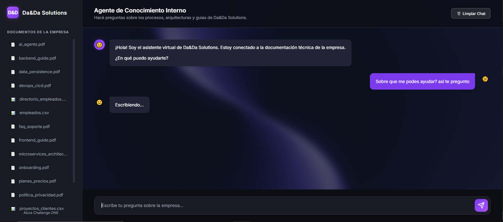
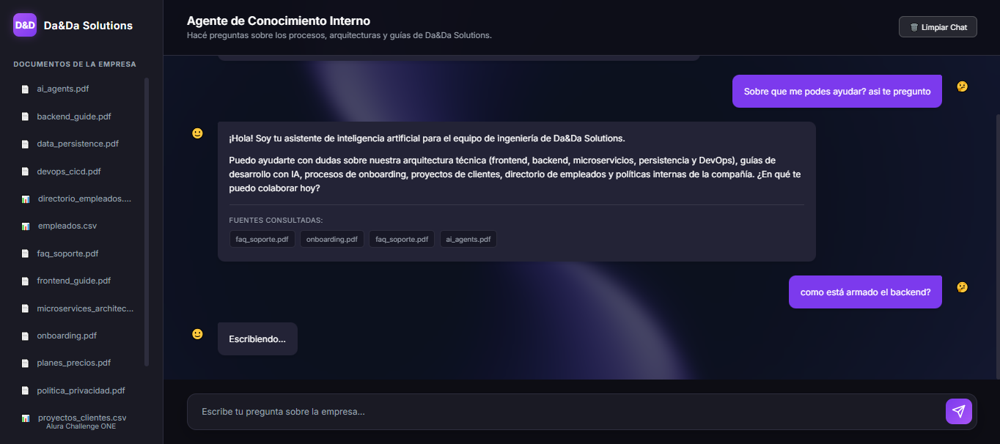
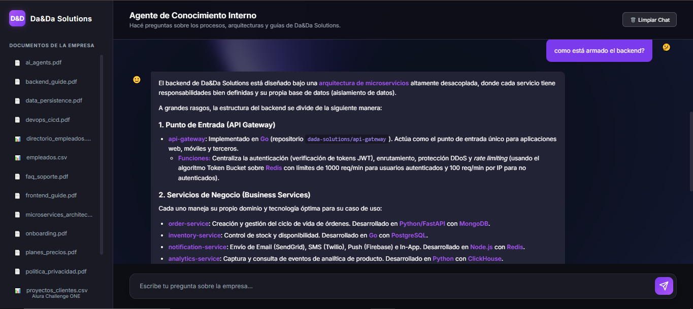
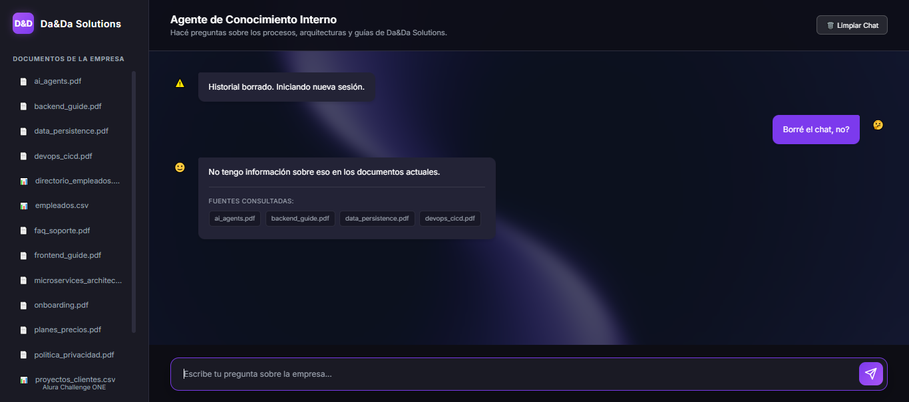

# 🤖 Alura Agente — Da&Da Solutions

Este proyecto es la entrega final del **Challenge Alura Agente**. Consiste en un sistema de Inteligencia Artificial basado en la técnica **RAG (Retrieval-Augmented Generation)** que permite a los empleados de la empresa ficticia *Da&Da Solutions* hacer preguntas en lenguaje natural sobre sus documentos internos técnicos.

## 🏗️ Arquitectura de la Solución

El proyecto está diseñado con una arquitectura moderna y modular:

1. **Ingestión de Documentos (Pipeline RAG):**
   - **Carga:** Se leen los documentos desde la carpeta `docs/`.
   - **Chunking:** El texto se divide en fragmentos (chunks) de 1000 caracteres.
   - **Embeddings:** Se utiliza `Google Generative AI (gemini-embedding-2)` para convertir el texto en vectores.
   - **Vector Store:** Los vectores se indexan localmente usando `FAISS`.

2. **Backend (API) y Memoria:**
   - Desarrollado en **FastAPI** (Python).
   - Utiliza **LangChain** (LCEL) como framework orquestador del agente RAG.
   - Utiliza **Google Gemini (gemini-3.5-flash)** como LLM para generar respuestas fluidas y precisas en español, basándose estrictamente en el contexto recuperado.
   - **Persistencia de Sesiones:** Utiliza **SQLite** (`chat_history.db`) y SQLAlchemy para almacenar el historial de conversaciones, otorgándole al bot memoria a largo plazo a través de sesiones.

3. **Frontend (Interfaz de Usuario):**
   - Interfaz web custom (HTML, CSS nativo, Vanilla JS) con estética premium corporativa y *Glassmorphism*.
   - Renderiza etiquetas **Markdown** de forma segura usando `marked.js` y `DOMPurify` para evitar ataques XSS.
   - Muestra las fuentes (documentos y snippets) de las cuales el agente extrajo la información.

## 🛠️ Tecnologías y Herramientas Utilizadas

- **Lenguaje:** Python 3.11+
- **Framework Agente:** LangChain (LCEL)
- **LLM y Embeddings:** Google Gemini API (gemini-3.5-flash)
- **Vector Store y Memoria:** FAISS (CPU), SQLite (SQLAlchemy)
- **API Backend:** FastAPI, Uvicorn
- **UI:** HTML5, CSS3, Vanilla JS
- **Infraestructura (OCI):** Docker, Docker Compose

---

## 🚀 Instrucciones para ejecutar el proyecto

### Opción A: Despliegue con Docker (Ideal para OCI / Producción)
Esta es la forma más rápida y limpia de levantar el entorno en cualquier servidor en la nube (como Oracle Cloud Infrastructure).
```bash
# Crear el archivo .env con tu API Key
echo "GOOGLE_API_KEY=tu_api_key_aqui" > .env

# Levantar toda la aplicación en segundo plano
docker-compose up -d
```
> La aplicación estará disponible en: [http://localhost:8000](http://localhost:8000). La base de datos SQLite se creará automáticamente en la raíz del proyecto para persistir la memoria.

### Opción B: Ejecución Local de Desarrollo
1. **Configurar el entorno virtual**
```bash
python -m venv venv
# En Windows:
.\venv\Scripts\activate
# En Mac/Linux:
source venv/bin/activate

pip install -r requirements.txt
```

2. **Configurar variables de entorno**
Crea un archivo `.env` en la raíz del proyecto:
```bash
GOOGLE_API_KEY=tu_api_key_aqui
```

3. **Generar el índice Vectorial (Si no tienes el faiss_index)**
```bash
# Lee los documentos de docs/ y crea el índice FAISS
python ingest.py
```

4. **Iniciar la aplicación**
```bash
python server.py
```
> La aplicación estará disponible en: [http://localhost:8000](http://localhost:8000)

---

## 💬 Ejemplos de uso del agente

A continuación se presentan capturas de pantalla que demuestran el funcionamiento real del agente inteligente en la interfaz, mostrando cómo analiza los documentos y responde a las consultas del usuario:

### Ejecución 1


### Ejecución 2


### Ejecución 3


### Ejecución 4


### Ejecución 5


---
*Desarrollado para el Challenge de Alura - Formación en Inteligencia Artificial.*
